# Terraform — Vertex AI Fine-Tuning Infrastructure

This folder provisions the **baseline GCP resources** needed by the fine-tuning code using Terraform as Infrastructure as Code (IaC). The configuration manages:

- **Google Cloud APIs** — Vertex AI, Artifact Registry, Cloud Storage
- **Artifact Registry** — Docker repository for training images
- **GCS Bucket** — Storage for training data and model artifacts

---

## Prerequisites & Authentication

Terraform **does not store credentials in `.tf` files**. Authenticate using one of:

**ADC (recommended):**

```bash
gcloud auth application-default login
```

**Service account key (not recommended long-term):**

```bash
export GOOGLE_APPLICATION_CREDENTIALS="/abs/path/to/key.json"
```

---

## Step-by-Step Terraform Walkthrough

### Step 1 — Pre-Terraform State of GCP Resources

Before running any Terraform commands, here is the baseline state of the GCP project (`ResearchLineage`).

**Cloud Storage** — Only one pre-existing bucket (`test-bucket-cs-2`) exists:

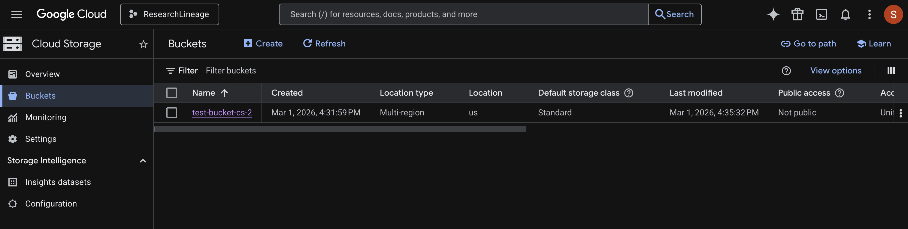

**Artifact Registry API** — The API is **not yet enabled** (notice the "Enable" button is available):

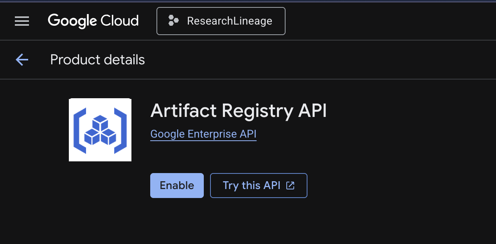

---

### Step 2 — Project File Structure

The Terraform configuration is organized into the following files inside `HW_LAB_4/`:

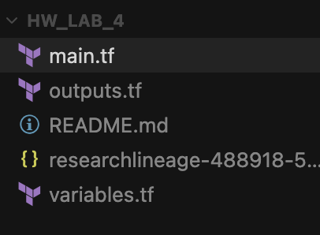

| File | Purpose |
|------|---------|
| `main.tf` | Core resource definitions (APIs, Artifact Registry repo, GCS bucket) |
| `variables.tf` | Input variable declarations (project ID, region, bucket name, etc.) |
| `outputs.tf` | Output values displayed after `apply` (bucket name, repo URL, etc.) |
| `researchlineage-488918-5...` | GCP service account key (JSON) for authentication |
| `README.md` | This documentation |

---

### Step 3 — `terraform init`

```bash
terraform init
```

This is always the **first command** you run. It initializes the working directory by:

1. **Initializing the backend** — Sets up where Terraform stores its state file (local by default).
2. **Downloading provider plugins** — Fetches the `hashicorp/google` provider (v7.23.0 in this case) which contains the logic for interacting with GCP APIs.
3. **Creating the lock file** — Generates `.terraform.lock.hcl` to pin exact provider versions for reproducibility.

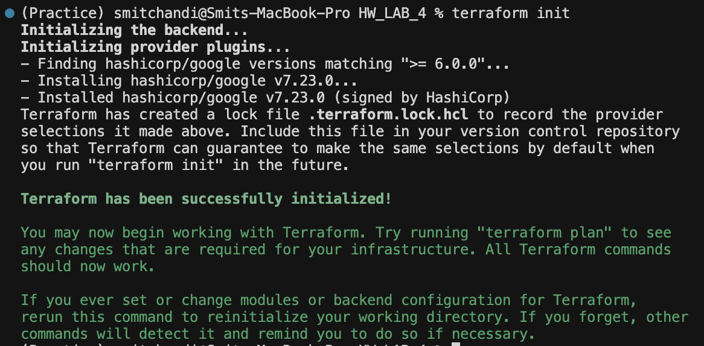

**What changed in the file system:** After `init`, two new entries appear — the `.terraform/` directory (containing downloaded provider binaries) and `.terraform.lock.hcl` (the dependency lock file):

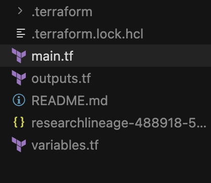

---

### Step 4 — `terraform plan`

```bash
terraform plan -out=tfplan
```

The `plan` command is a **dry run**. Terraform compares the desired state (defined in `.tf` files) against the current state of the infrastructure and produces an execution plan showing exactly what it will create, modify, or destroy — **without making any actual changes**.

The `-out=tfplan` flag saves the plan to a binary file so the exact same plan can be applied later, preventing drift between plan and apply.

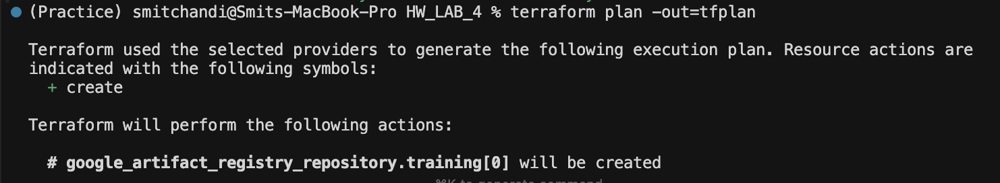

Terraform identifies that `google_artifact_registry_repository.training[0]` (and other resources) **will be created** (indicated by the `+ create` symbol).

At the end, the plan is saved to the `tfplan` file:

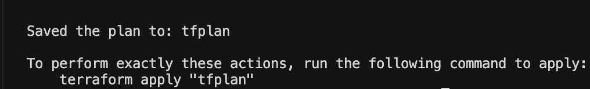

**What changed in the file system:** After `plan`, several new files appear — `terraform.tfstate` (state tracking), `.terraform.tfstate.lock.info` (state lock during operations), and the `tfplan` binary:

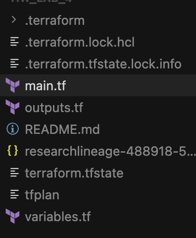

---

### Step 5 — `terraform apply`

```bash
terraform apply "tfplan"
```

This is where Terraform **actually provisions the infrastructure**. By passing the saved `tfplan` file, Terraform executes the exact plan that was reviewed — no confirmation prompt needed since the plan was pre-approved.

Terraform creates the resources in dependency order:

1. **First** — Enables the three GCP APIs (`storage`, `artifact_registry`, `vertex_ai`) since other resources depend on them. These take ~22 seconds each.
2. **Then** — Creates the dependent resources: the GCS bucket (`test-bucket-cs-3`, completes in 1s) and the Artifact Registry Docker repository (`training`, completes in 11s).

The final summary confirms: **5 resources added, 0 changed, 0 destroyed.**

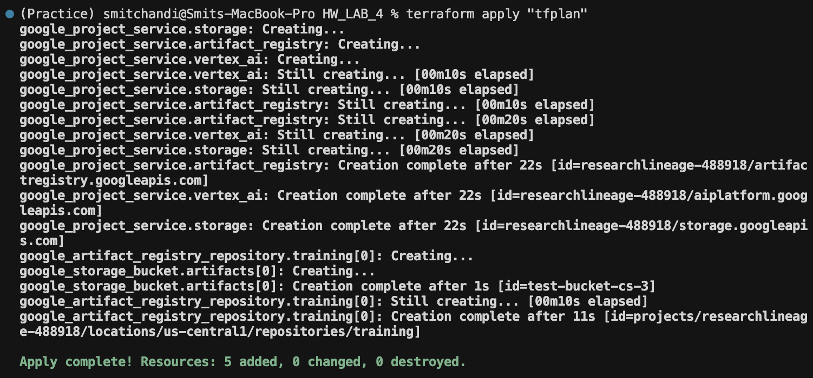

---

### Step 6 — Verifying the Created Resources in GCP Console

After `apply` completes, we can verify that all resources were actually provisioned in the GCP Console.

**Cloud Storage** — A new bucket `test-bucket-cs-3` now appears alongside the pre-existing `test-bucket-cs-2`. Note the location is `us-central1` (Region) as configured in the Terraform variables:

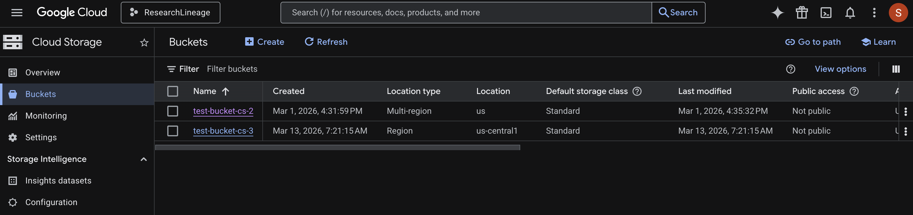

**Artifact Registry API** — The API is now **enabled** (the button now says "Manage" and shows a green "API Enabled" badge):

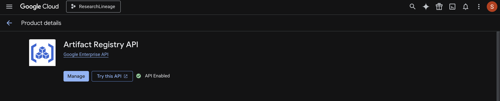

---

### Step 7 — `terraform destroy`

```bash
terraform destroy
```

The `destroy` command is the **reverse of apply** — it tears down all resources managed by the current Terraform state. This is essential for cost management and cleanup.

First, Terraform **refreshes the state** of each resource by querying GCP to see their current status:

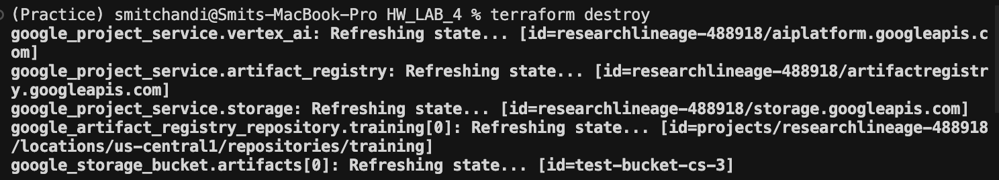

Terraform then presents a **destruction plan** and requires explicit confirmation. Type `yes` to proceed:

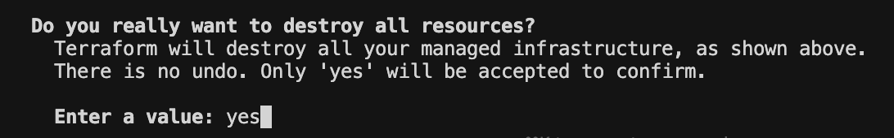

Terraform destroys resources in **reverse dependency order**: dependent resources first (Artifact Registry repo, GCS bucket), then the API services. The final summary confirms: **5 resources destroyed.**

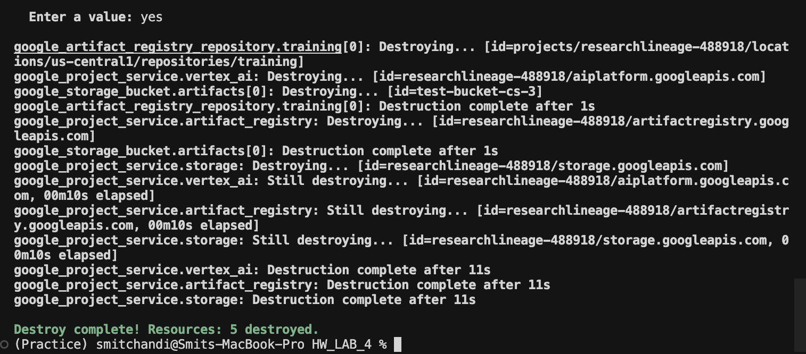

---

### Step 8 — Verifying Destruction in GCP Console

After `destroy` completes, the GCP Console confirms that all Terraform-managed resources have been removed.

**Cloud Storage** — Only the original `test-bucket-cs-2` remains; `test-bucket-cs-3` has been deleted:

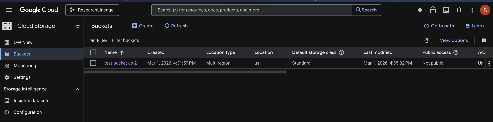

**Artifact Registry API** — The API has been **disabled** again (the "Enable" button is back):

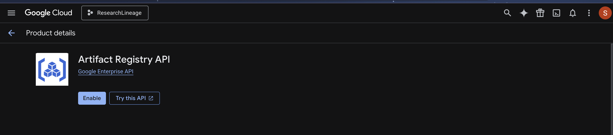

---

## Terraform Lifecycle Summary

```
terraform init      →  Download providers, initialize backend
terraform plan      →  Preview changes (dry run), optionally save to file
terraform apply     →  Provision infrastructure for real
terraform destroy   →  Tear down all managed resources
```

The key concept is that Terraform maintains a **state file** (`terraform.tfstate`) that maps your `.tf` configuration to real-world resources. Every command compares desired state (config) vs. actual state (cloud) vs. known state (state file) to determine what actions to take.

---

## Quick Start

```bash
cd HW_LAB_4
gcloud auth application-default login     # authenticate
terraform init                             # download providers
terraform plan -out=tfplan                 # preview changes
terraform apply "tfplan"                   # provision resources
# ... do your work ...
terraform destroy                          # clean up when done
```

## Notes

- If your bucket already exists, leave `create_bucket = false`. To import an existing bucket into state:

```bash
terraform import 'google_storage_bucket.artifacts[0]' <bucket-name>
```
