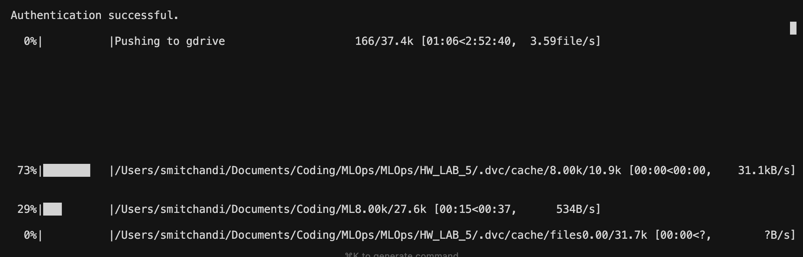
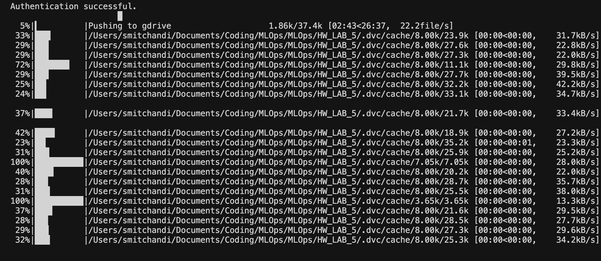
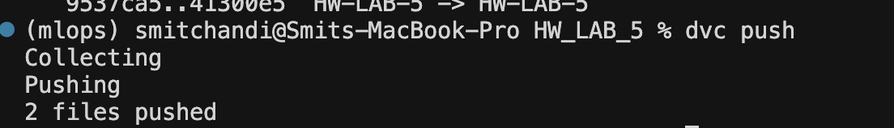
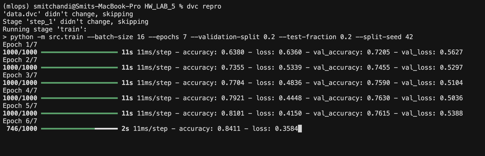
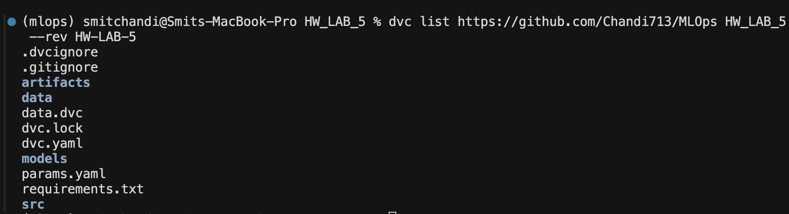

# HW LAB 5 — Cats vs Dogs Image Classifier with DVC

A CNN-based binary image classifier (cats vs. dogs) that uses **DVC (Data Version Control)** to version large datasets, manage ML pipeline stages, and sync artifacts with remote storage (Google Drive).

---

## Table of Contents

1. [Project Overview](#1-project-overview)
2. [Project Structure](#2-project-structure)
3. [What is DVC?](#3-what-is-dvc)
4. [How DVC is Used in This Project](#4-how-dvc-is-used-in-this-project)
   - [Data Versioning](#41-data-versioning-datadvc)
   - [Remote Storage](#42-remote-storage-google-drive)
   - [ML Pipeline](#43-ml-pipeline-dvcyaml)
   - [Parameters](#44-parameters-paramsyaml)
   - [Lock File](#45-lock-file-dvclock)
5. [Running the Project](#5-running-the-project)
6. [DVC Commands Walkthrough](#6-dvc-commands-walkthrough)

---

## 1. Project Overview

This project trains a Convolutional Neural Network (CNN) to classify images as either **cats** or **dogs** using the Kaggle Dogs vs. Cats dataset (25,000 training images). The full ML workflow — data preparation, training, evaluation, and model saving — is orchestrated as a **reproducible DVC pipeline**.

**Model architecture:** 2× Conv2D → MaxPool → Flatten → Dense layers with binary cross-entropy loss.

**Final metrics (7 epochs, batch size 16):**
- Training accuracy: ~84%
- Validation accuracy: ~76%

---

## 2. Project Structure

```
HW_LAB_5/
├── data/                    # Raw image data (tracked by DVC, not Git)
│   └── train/               # 25,000 cat/dog .jpg images
├── artifacts/               # Intermediate pipeline outputs (DVC-tracked)
│   ├── X_train.pickle       # Preprocessed image tensors
│   ├── y_train.pickle       # Labels
│   ├── X_test.pickle        # Test split
│   ├── y_test.pickle
│   ├── model.keras          # Trained model
│   ├── train_metrics.json   # Loss/accuracy after training
│   └── eval_metrics.json    # Final evaluation metrics
├── models/
│   └── model.keras          # Final saved model
├── src/
│   ├── constants.py         # Shared paths and constants
│   ├── prepare_dataset.py   # Stage 1: images → pickle tensors
│   ├── train.py             # Stage 2: train CNN
│   ├── evaluate.py          # Stage 3: evaluate on test set
│   └── save_model.py        # Stage 4: copy model to models/
├── data.dvc                 # DVC pointer file for the data/ directory
├── dvc.yaml                 # Pipeline stage definitions
├── dvc.lock                 # Locked hashes for reproducibility
├── params.yaml              # Hyperparameters for the pipeline
└── .dvc/
    └── config               # DVC remote storage configuration
```

---

## 3. What is DVC?

**DVC (Data Version Control)** is an open-source tool that brings Git-like versioning to large files, datasets, and ML experiments. It solves a core problem in MLOps: Git is not designed to store gigabyte-scale data, but you still need to track *which version of the data* produced *which model*.

DVC works **alongside Git**:
- Git tracks code, config, and small text files.
- DVC tracks large files (data, models, artifacts) and stores them in a **remote storage** (S3, GCS, Google Drive, etc.).
- DVC commits lightweight **pointer files** (`.dvc` files) to Git instead of the actual data.

```
┌─────────────────────────────────────────────────────┐
│  Git Repository                                      │
│  ┌───────────────┐    ┌──────────────────────────┐  │
│  │  Code / YAML  │    │  data.dvc (pointer)      │  │
│  │  dvc.yaml     │    │  md5: 3f108fb120a0b...   │  │
│  │  params.yaml  │    │  size: 857490533 bytes   │  │
│  │  dvc.lock     │    │  nfiles: 37501           │  │
│  └───────────────┘    └──────────────────────────┘  │
└───────────────────────────────┬─────────────────────┘
                                │ dvc push / pull
                    ┌───────────▼───────────┐
                    │   Remote Storage       │
                    │   (Google Drive)       │
                    │   Actual image files   │
                    │   Pickle artifacts     │
                    │   Trained models       │
                    └───────────────────────┘
```

---

## 4. How DVC is Used in This Project

### 4.1 Data Versioning — `data.dvc`

The `data/` folder holds **37,501 files** totalling ~857 MB of raw images. Storing this in Git is impractical. Instead, DVC replaces it with a tiny pointer file committed to Git:

```yaml
# data.dvc
outs:
- md5: 3f108fb120a0b572693f4670ff586109.dir
  size: 857490533
  nfiles: 37501
  hash: md5
  path: data
```

The MD5 hash uniquely identifies the exact version of the entire `data/` directory. Anyone who clones the repo can run `dvc pull` to download the matching data from remote storage.

### 4.2 Remote Storage — Google Drive

The remote is configured in `.dvc/config`:

```ini
[core]
    remote = gdrive
['remote "gdrive"']
    url = gdrive://1sj7_f_LOiMSFsWsdOxbrbTALpa42OGsh
    gdrive_acknowledge_abuse = true
```

When you run `dvc push`, DVC uploads the locally cached files to this Google Drive folder. The screenshots below show the push in action — first the initial full upload of the 25,000-image dataset (~571 MB from the `.dvc/cache`):

**Initial dataset push (37.4k files uploading to Google Drive):**



*DVC authenticates with Google Drive and begins uploading the `.dvc/cache` files — the dataset cache containing all 25,000 images organized by their MD5 hash.*

**Push in progress (multiple cache subdirectories being uploaded):**



*Each file in DVC's local cache (`.dvc/cache/files/md5/8.00k/...`) is uploaded to the remote. This ensures any team member can `dvc pull` to retrieve the exact same dataset.*

**Final artifact push after a new pipeline run:**



*After running `dvc repro`, only 2 new files (updated model artifacts) are pushed — DVC is content-addressed, so unchanged files are never re-uploaded.*

### 4.3 ML Pipeline — `dvc.yaml`

`dvc.yaml` defines the **four pipeline stages** as a DAG (Directed Acyclic Graph). DVC tracks which inputs each stage depends on, so it only re-runs stages whose dependencies have changed.

```
data/train/  ──→  [step_1: prepare_dataset]  ──→  X_train.pickle, y_train.pickle
                                                           │
                                                           ▼
                                              [train: train CNN]  ──→  model.keras
                                                           │             │
                                                           ▼             ▼
                                              [evaluate]            [save_model]
                                                    │
                                                    ▼
                                             eval_metrics.json
```

| Stage | Command | Inputs | Outputs |
|-------|---------|--------|---------|
| `step_1` | `python -m src.prepare_dataset` | `data/train/` (25k images) | `X_train.pickle`, `y_train.pickle` |
| `train` | `python -m src.train` | Train pickles + hyperparams | `model.keras`, `train_metrics.json`, test pickles |
| `evaluate` | `python -m src.evaluate` | `model.keras` + test pickles | `eval_metrics.json` |
| `save_model` | `python -m src.save_model` | `artifacts/model.keras` | `models/model.keras` |

**Running the full pipeline with `dvc repro`:**



*`dvc repro` checks each stage against its locked state in `dvc.lock`. Here, `data.dvc` and `step_1` are unchanged (skipped), and only the `train` stage re-runs because `params.yaml` was modified. The CNN trains for 7 epochs, reaching ~84% training accuracy.*

### 4.4 Parameters — `params.yaml`

All tunable hyperparameters live in `params.yaml` and are referenced by `dvc.yaml`. This makes experiments reproducible and diff-able in Git:

```yaml
prepare:
  seed: 42          # Shuffle seed for dataset preparation

train:
  batch_size: 16
  epochs: 7
  validation_split: 0.2
  test_fraction: 0.2
  split_seed: 42
```

When a parameter changes, DVC detects which downstream stages are affected and only re-runs those. For example, changing `epochs` only invalidates the `train`, `evaluate`, and `save_model` stages — not `step_1` (data preparation).

### 4.5 Lock File — `dvc.lock`

`dvc.lock` is auto-generated by DVC after a successful `dvc repro`. It records the exact MD5 hash of every dependency and output for every stage:

```yaml
stages:
  step_1:
    cmd: python -m src.prepare_dataset --seed 42
    deps:
    - path: data/train
      md5: b327c642538be3874f0856f44292f621.dir  # Hash of all 25k images
      nfiles: 25000
    outs:
    - path: artifacts/X_train.pickle
      md5: 5d4ca5b021ea5da3f850787f84e6bb28
  train:
    outs:
    - path: artifacts/model.keras
      md5: bf273b2c36dd0c042ba5fc5999cfc4c1
      size: 3716961
    ...
```

This file is committed to Git and serves as a reproducibility receipt — anyone can verify they have the exact same pipeline state.

### 4.6 Inspecting the Remote with `dvc list`

The `dvc list` command lets you browse what's stored in a remote DVC repository without downloading it:



*`dvc list https://github.com/Chandi1713/MLOps HW_LAB_5 --rev HW-LAB-5` shows the project's tracked files: `.dvcignore`, `.gitignore`, `artifacts/`, `data/`, `data.dvc`, `dvc.lock`, `dvc.yaml`, `models/`, `params.yaml`, `requirements.txt`, and `src/`.*

---

## 5. Running the Project

### Prerequisites

```bash
pip install -r requirements.txt
```

### First-time setup: pull data from remote

```bash
dvc pull          # downloads data/ and artifacts/ from Google Drive
```

### Run the full pipeline

```bash
dvc repro         # runs all stages (skips unchanged ones)
```

### Run only changed stages

```bash
# Edit params.yaml, then:
dvc repro         # only re-runs affected stages
```

### Push new artifacts after a run

```bash
git add dvc.lock params.yaml
git commit -m "New experiment run"
dvc push          # uploads new/changed artifacts to Google Drive
git push
```

---

## 6. DVC Commands Walkthrough

| Command | What it does in this project |
|---------|------------------------------|
| `dvc init` | Initializes DVC in the repo (done once) |
| `dvc remote add gdrive gdrive://...` | Registers Google Drive as the remote storage |
| `dvc add data/` | Creates `data.dvc` and starts tracking the image dataset |
| `dvc push` | Uploads `.dvc/cache` files to Google Drive |
| `dvc pull` | Downloads tracked files from Google Drive |
| `dvc repro` | Runs the pipeline (skips up-to-date stages) |
| `dvc status` | Shows which stages or files are out of sync |
| `dvc list <repo> <path>` | Lists DVC-tracked files in a remote Git+DVC repo |
| `dvc params diff` | Shows how `params.yaml` changed between runs |
| `dvc metrics show` | Displays `eval_metrics.json` values |

---

## Key Takeaway

Without DVC, this project would require either committing 857 MB of images to Git (impractical) or manually managing which dataset version was used for each model run (error-prone). DVC bridges this gap: **Git tracks the code and the DVC pointer files; DVC tracks the data and artifacts**. The result is a fully reproducible pipeline where every model can be traced back to the exact dataset, code, and hyperparameters that produced it.
