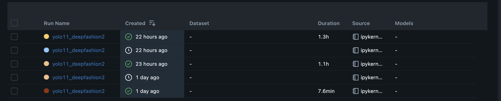
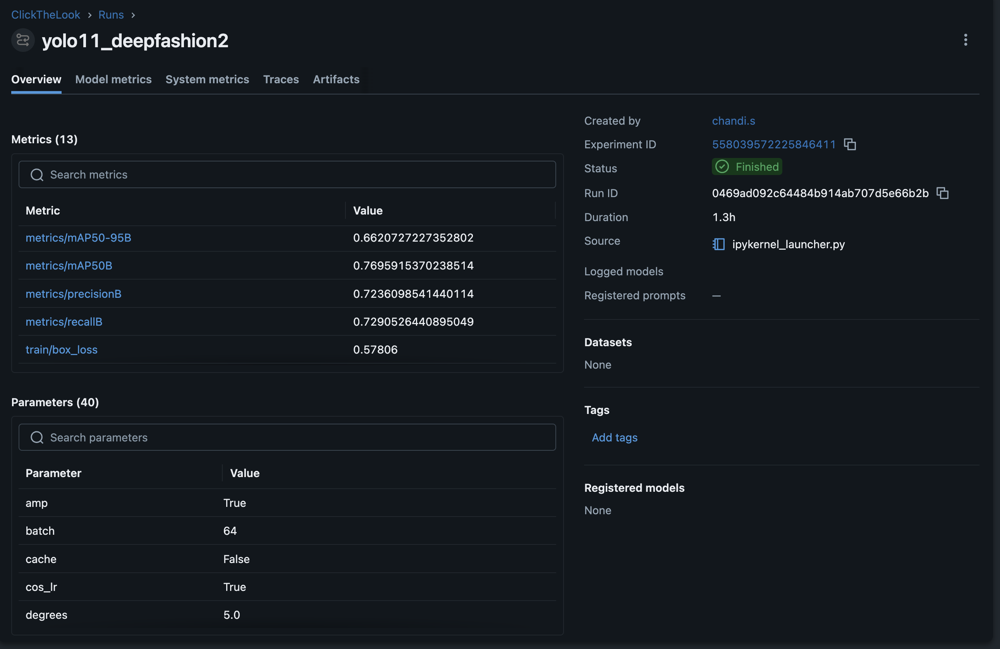
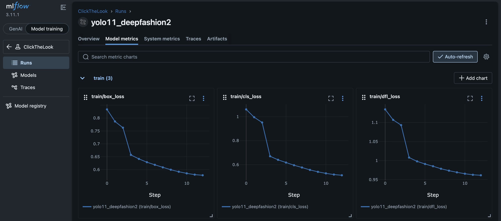
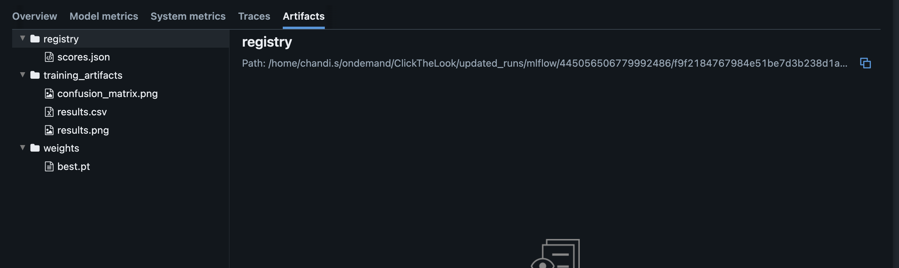
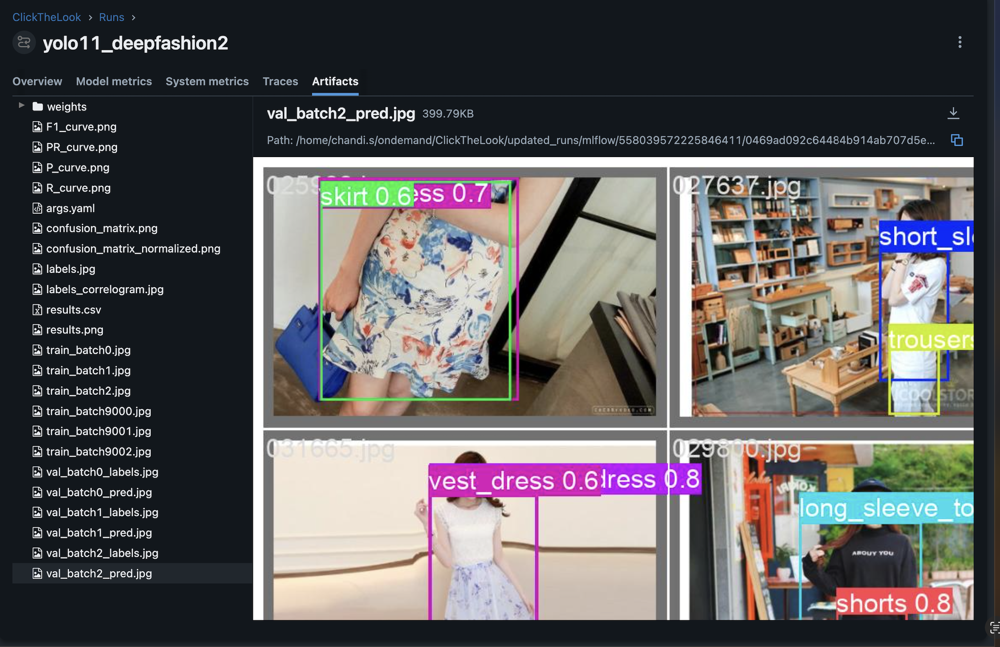

# MLflow Integration — ClickTheLook

MLflow is used as the experiment tracking backbone for every training run in this project. Every time `scripts/main.py` executes, a new run is opened, all hyperparameters and post-training metrics are recorded, artifacts are stored, and the run is closed — creating a permanent, comparable record without any manual bookkeeping.

---

## Table of Contents

1. [Configuration](#configuration)
2. [Launching the Dashboard](#launching-the-dashboard)
3. [What Gets Tracked Per Run](#what-gets-tracked-per-run)
4. [Dashboard Walkthrough](#dashboard-walkthrough)
5. [Model Registry Logic](#model-registry-logic)

---

## Configuration

MLflow is configured through environment variables loaded from `.env` via `config.py`:

| Variable | Default | Purpose |
|---|---|---|
| `MLFLOW_TRACKING_URI` | `./mlruns` | Where run data is written on disk |
| `MLFLOW_EXPERIMENT` | `ClickTheLook` | Experiment name that groups all runs |

```python
# config.py
MLFLOW_TRACKING_URI = os.getenv("MLFLOW_TRACKING_URI", "./mlruns")
MLFLOW_EXPERIMENT   = os.getenv("MLFLOW_EXPERIMENT",   "ClickTheLook")
```

Override these in `.env` to point at a remote tracking server or a different local path. On an HPC cluster, set `MLFLOW_TRACKING_URI` to a persistent shared path so runs survive across sessions.

---

## Launching the Dashboard

### Locally

```bash
mlflow ui --backend-store-uri ./mlruns --port 5000
# then open http://localhost:5000
```

### On the Explorer HPC Cluster

MLflow runs on a compute node. Because cluster firewall rules block direct port access from the login node, use an SSH jump-host tunnel from your laptop:

```bash
# Terminal 1 — on the compute node, start MLflow
mlflow ui \
  --backend-store-uri $MLFLOW_TRACKING_URI \
  --host 0.0.0.0 \
  --port 5000

# Terminal 2 — on your laptop, open the tunnel
ssh -J <user>@<cluster-login-node> \
    -L 5000:localhost:5000 \
    <user>@<compute-node>
```

Then open `http://localhost:5000` in your browser. The `-J` (jump-host) flag establishes a full SSH connection through the login node directly to the compute node, so `localhost:5000` in the tunnel refers to the compute node — where MLflow is actually listening.

> **Note:** `-L 5000:<compute-node>:5000` via the login node will not work because the login node's firewall blocks outbound TCP to compute node ports. Always use `-J` instead.

---

## What Gets Tracked Per Run

Each run in the `ClickTheLook` experiment captures the following:

### Parameters (40)

All keys from `TRAINING_CONFIG` in `config.py` are logged verbatim:

```python
mlflow.log_params({k: str(v) for k, v in TRAINING_CONFIG.items()})
```

This covers the full training setup — model, epochs, batch size, image size, optimizer, learning-rate schedule, all data-augmentation knobs, device, and output settings. Having all 40 params per run makes it straightforward to diff any two runs and understand exactly what changed.

### Metrics

**Overall validation metrics** (logged after `model.val()`):

| Key | Description |
|---|---|
| `mAP50` | Mean Average Precision at IoU 0.50 |
| `mAP50_95` | Mean Average Precision at IoU 0.50–0.95 |
| `precision` | Mean precision across all classes |
| `recall` | Mean recall across all classes |

**Per-class AP50** — one metric per DeepFashion2 category:

`AP50_short_sleeve_top`, `AP50_long_sleeve_top`, `AP50_short_sleeve_outwear`, `AP50_long_sleeve_outwear`, `AP50_vest`, `AP50_sling`, `AP50_shorts`, `AP50_trousers`, `AP50_skirt`, `AP50_short_sleeve_dress`, `AP50_long_sleeve_dress`, `AP50_vest_dress`, `AP50_sling_dress`

```python
mlflow.log_metrics({
    "mAP50":     metrics.box.map50,
    "mAP50_95":  metrics.box.map,
    "precision": metrics.box.mp,
    "recall":    metrics.box.mr,
})
for cls_name, ap in zip(class_names, metrics.box.ap50):
    mlflow.log_metric(f"AP50_{cls_name}", ap)
```

### Tags

| Tag | Values | Meaning |
|---|---|---|
| `registry_result` | `best` / `last` / `discarded` | How this run ranked against stored checkpoints |
| `base_model` | e.g. `yolo11n.pt` | Pretrained backbone used |
| `run_name` | `yolo11_deepfashion2` | YOLO output directory name |

Tags let you filter the runs table in the dashboard to only show runs that produced a new best model.

### Artifacts

The following files are stored under the run's artifact path:

```
training_artifacts/
    results.png          # training + validation loss/metric curves
    results.csv          # same data in tabular form
    confusion_matrix.png # per-class confusion matrix

weights/
    best.pt              # saved only when this run is the new best (registry_result = "best")

registry/
    scores.json          # stores {best: <mAP50>, last: <mAP50>} for cross-run comparison
```

---

## Dashboard Walkthrough

### Runs List

The entry point of the MLflow UI. Every execution of `main.py` creates a new row.



Each row shows the run name (`yolo11_deepfashion2`), creation time, duration, and source (`ipykernel_launcher.py` when run from Jupyter / ipykernel). Status indicators distinguish finished runs (green check) from runs that were interrupted. Across the five runs shown, durations range from 7.6 min (quick sanity check) to 1.3 h (full training), making it easy to spot which runs were full training passes vs. short tests.

---

### Run Overview — Metrics & Parameters

Clicking any run opens its Overview tab, which surfaces the most important numbers at a glance.



**Metrics panel (left)** shows the 13 logged metrics for the run. The best run achieved:

- `metrics/mAP50-95B` → **0.662**
- `metrics/mAP50B` → **0.7670**
- `metrics/precisionB` → **0.7236**
- `metrics/recallB` → **0.7290**
- `train/box_loss` → **0.578**

**Parameters panel** lists all 40 training hyperparameters. Scrolling through them reveals the exact configuration used — `amp=True`, `batch=64`, `cache=False`, `cos_lr=True`, `degrees=5.0`, etc.

**Run metadata (right)** provides the experiment ID, run ID, duration (1.3 h), source file, and status. The run ID links directly to the artifact storage path on disk.

---

### Model Metrics — Training Loss Curves

The **Model metrics** tab renders interactive time-series charts for every metric logged across steps, automatically grouped by prefix.



Three loss components are tracked across training steps:

| Chart | What it measures |
|---|---|
| `train/box_loss` | Bounding-box regression loss |
| `train/cls_loss` | Classification loss |
| `train/dfl_loss` | Distribution focal loss (fine localisation) |

All three curves show a consistent downward trend, confirming that the model is converging. The left sidebar shows the full MLflow 3.11.1 navigation: **Runs**, **Models**, **Traces**, and **Model registry** — all accessible from within the same UI.

---

### Artifacts — Registry & Training Outputs

The **Artifacts** tab provides a file browser over everything logged with `mlflow.log_artifact`.



The tree is organised into three folders matching exactly what the pipeline logs:

- **`registry/scores.json`** — the running best/last mAP50 scores used by `update_model_registry` to decide whether to promote a new checkpoint
- **`training_artifacts/`** — `confusion_matrix.png`, `results.csv`, and `results.png` from the YOLO training run output directory
- **`weights/best.pt`** — the checkpoint file, only present when `registry_result = "best"`

The path shown at the top of the Artifacts tab is the physical location on the filesystem where these files live, rooted at `MLFLOW_TRACKING_URI`.

---

### Validation Prediction Previews

For runs with a full artifact set logged, the **Artifacts** tab also stores YOLO's validation batch visualisations — ground-truth labels and model predictions side by side.



The left panel lists the complete artifact tree for this run, which includes the full YOLO output:

```
weights/           F1_curve.png       PR_curve.png
P_curve.png        R_curve.png        args.yaml
confusion_matrix.png (+ normalized)  labels.jpg
labels_correlogram.jpg               results.csv / results.png
train_batch{0,1,2,9000,9001,9002}.jpg
val_batch{0,1,2}_labels.jpg
val_batch{0,1,2}_pred.jpg
```

The preview panel renders `val_batch2_pred.jpg` directly in the browser, showing the model's detections on unseen validation images with class names and confidence scores (`skirt 0.6`, `dress 0.7`, `vest_dress 0.6`, `trousers`, `long_sleeve_top`, `shorts 0.8`). This provides a qualitative sanity check alongside the quantitative metrics without leaving the MLflow UI.

---

## Model Registry Logic

After each training run, `update_model_registry` in `src/training/train.py` compares the new run's `mAP50` against the scores stored in `weights/scores.json` and decides what to do with the checkpoint:

```
new > best          →  new becomes best, old best demoted to last.pt
                       Returns (True, "best")   ← model is exported to ONNX

last < new ≤ best   →  new becomes last.pt.
                       Returns (False, "last")  ← saved but not exported

new ≤ last          →  checkpoint discarded.
                       Returns (False, "discarded")
```

On the very first run (no `scores.json` yet) the new model automatically becomes best.

The outcome is written back to MLflow as the `registry_result` tag, making it trivial to filter the runs table to only show runs that produced a new best model. The `weights/best.pt` artifact is only uploaded to the run when `registry_result = "best"`, keeping artifact storage lean.
